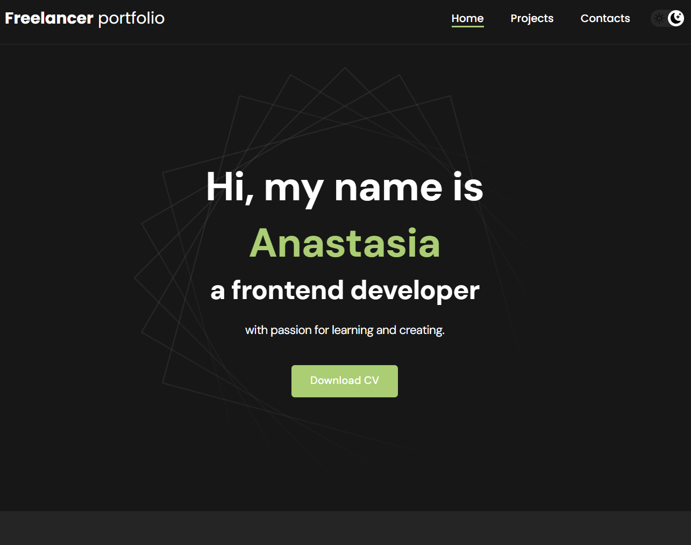

<<<<<<< HEAD
# Portfolio App Мазуркевич Анастасия

Моё персональное портфолио, созданное на React. Здесь представлены мои проекты, навыки и контакты.

**Сайт** [siazur.github.io/portfolio](https://siazur.github.io/portfolio/)



## Возможности

- Портфолио с проектами
- Адаптивный дизайн (мобилки/планшеты/десктоп)
- Страница контактов
- Работает на Vite 

## Технологии 

- **Frontend:** React, JavaScript (ES6+), HTML5, CSS3
- **Сборка:** Vite
- **Инструменты:** Git, GitHub Pages

## Структура проекта

```
project_portfolio-react/
├── public/ 
├── src/
│ ├── components/ 
│ ├── pages/ 
│ ├── styles/ 
│ ├── img/ 
│ │ └── projects/ 
│ ├── helpers/ 
│ ├── utils/ 
│ ├── App.js
│ └── index.js
├── package.json
└── README.md
```

## Лицензия 

MIT © [siazur](https://github.com/siazur)

## Автор

- GitHub [@siazur](https://github.com/siazur)
=======
# portfolio
>>>>>>> 97aedad31883abe7983cfb248c99c28f09954bdf
